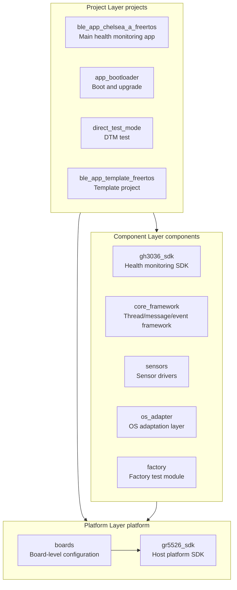
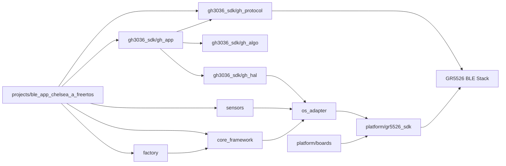
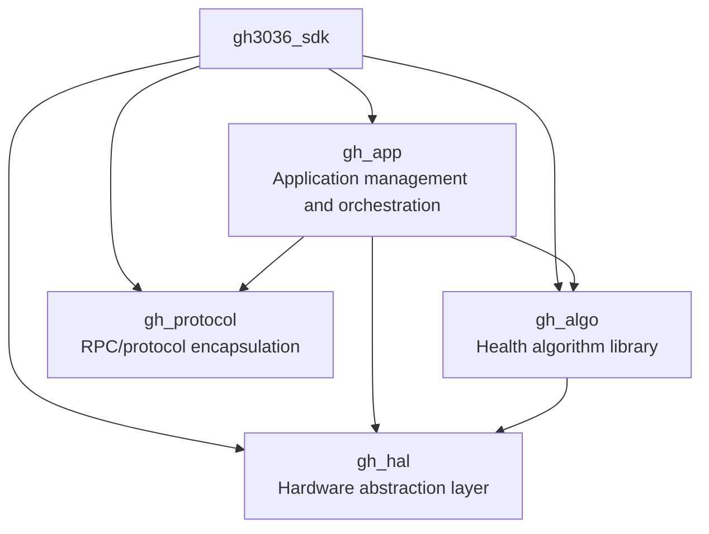
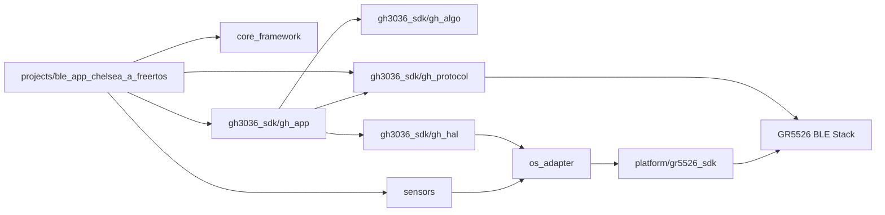
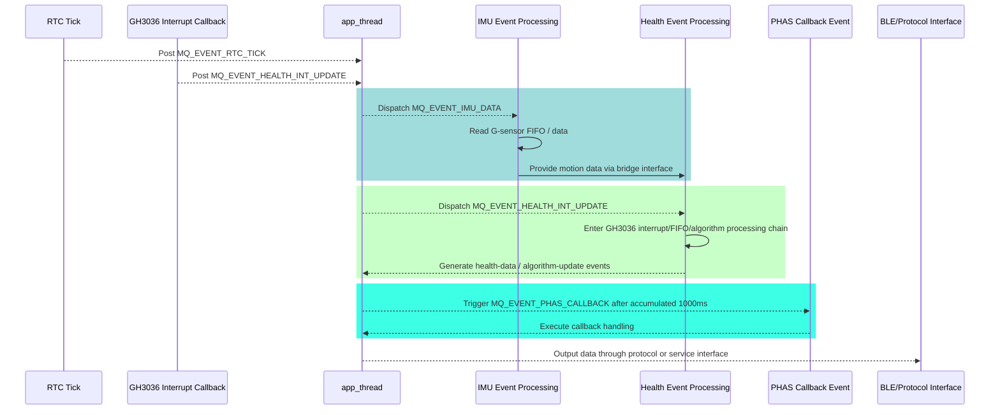
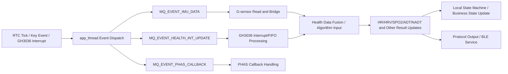

# L-EVK-T2-GH3038Q

## 1. Project Overview

`L-EVK-T2-GH3038Q` is an evaluation kit project based on the Goodix `GH3036` health monitoring chip, targeting the `GR5526 + GH3036` platform. The repository includes:

- Complete evaluation board application projects
- GH3036 health algorithm and driver SDK
- Core thread/message framework
- Sensor drivers and OS adaptation layer
- Factory test and mass-production-related modules

Applicable scenarios include:

- Heart Rate (HR) monitoring
- Heart Rate Variability (HRV) monitoring
- Blood Oxygen (SPO2) monitoring
- Wear detection / live detection
- BLE data reporting
- Factory test and production tuning

Related documentation:

- Project documentation: https://alidocs.dingtalk.com/i/nodes/1DKw2zgV2P7D273GsDR4Xbpp8B5r9YAn?utm_scene=team_space

---

## 2. Repository Positioning and Overall View

Overall, this repository is not a single application. It is a combination of **platform + components + application projects**:

- `platform/` provides host-chip SDK and low-level platform capabilities
- `components/` provides GH3036-related functional modules and reusable common components
- `projects/` provides final project entry points for different usage scenarios

It can be understood as:

1. **Platform layer**: makes the chip and basic system run
2. **Component layer**: handles how health data is collected, processed, and managed
3. **Project layer**: assembles the modules into deliverable firmware projects

---

## 3. Overall Software Architecture

To avoid mixing different project dependencies into a single figure, this section is split into two parts:

- **Repository layering diagram**: shows the overall repository layering
- **Main project dependency diagram**: shows the core module dependencies of `ble_app_chelsea_a_freertos`

### 3.1 Repository Layering Diagram



### 3.2 Repository Layering Notes

- `projects/` is the project entry layer used to host final firmware projects for different purposes.
- `components/` is the reusable functional layer, encapsulating health monitoring, system framework, sensors, and adaptation capabilities.
- `platform/` is the low-level platform layer, providing the host SDK and board-level support.
- Not every project under `projects/` depends on every module under `components/`, so this diagram only expresses repository layering rather than per-project implementation details.

### 3.3 Main Project Dependency Diagram

The following diagram focuses on the core dependencies of `ble_app_chelsea_a_freertos`:



### 3.4 Main Project Dependency Notes

- `ble_app_chelsea_a_freertos` is the most complete business application in the repository.
- It explicitly depends on `gh3036_sdk`, `core_framework`, `sensors`, `os_adapter`, `factory`, and related modules.
- `gh3036_sdk` itself is further divided into application, algorithm, HAL, and protocol sublayers.
- All upper-layer capabilities eventually run on `platform/gr5526_sdk` and board-level configuration.

### 3.5 Component Layer Notes

- `components/gh3036_sdk` is the core business component, responsible for GH3036-related sampling, algorithms, protocol handling, and application encapsulation.
- `components/core_framework` provides runtime framework capabilities such as application thread management, event dispatch, message queues, and module scheduling.
- `components/sensors` provides peripheral sensor support such as G-sensor drivers.
- `components/os_adapter` adapts component capabilities to the actual RTOS/platform environment.
- `platform/gr5526_sdk` provides host-chip drivers, interrupts, communication, BLE, clocking, and other basic capabilities.

---

## 4. Directory Structure and Module Responsibilities

```text
l-evk-t2-gh3038-q/
├── components/
│   ├── gh3036_sdk/        # GH3036 SDK: algorithm, app, HAL, protocol
│   ├── core_framework/    # Core framework: thread, event, message mechanisms
│   ├── sensors/           # Sensor drivers such as accelerometers
│   ├── os_adapter/        # Operating system adaptation layer
│   └── factory/           # Factory test module
├── config/                # Algorithm/test configuration files
├── platform/
│   ├── boards/            # Board-level configuration
│   └── gr5526_sdk/        # Host-chip SDK
└── projects/              # Final project entry points
```

### 4.1 Internal Structure of `components/gh3036_sdk`

`gh3036_sdk` is the core module of this repository and can be divided into four layers:



#### Responsibilities of Each Submodule

| Module | Role | Description |
|------|------|------|
| `gh_app` | Application layer encapsulation | Handles business flow, state switching, algorithm scheduling, and result management |
| `gh_algo` | Algorithm layer | Includes `adt/hr/hrv/nadt/spo2/common` and other health algorithms |
| `gh_hal` | Hardware abstraction layer | Shields GH3036 chip access details and connects to I2C/SPI, interrupt, timing, etc. |
| `gh_protocol` | Communication protocol layer | RPC commands, data packaging, protocol interaction, and host/debug command interfaces |

---

## 5. Module Interaction Relationships

The following describes the dependencies from the perspective of how the main project organizes health-related business processing:



### Relationship Notes

1. `ble_app_chelsea_a_freertos` is the main project entry and is responsible for initializing platform, services, and business modules.
2. `core_framework` provides a unified `app_thread`, message queue, and event dispatch mechanism to connect IMU, Health, PHAS, and related modules.
3. Health business logic is orchestrated by `gh3036_sdk/gh_app`.
4. Specific health algorithms are executed by `gh_algo`.
5. GH3036 chip access and interrupt handling are managed by `gh_hal`.
6. Peripheral data such as G-sensor data is provided by `sensors` and bridged into the health algorithm side.
7. `os_adapter` maps tasks, locks, time, and interrupt abstractions to the actual platform implementation.
8. Upper-layer capabilities finally rely on `platform/gr5526_sdk` and output data through the protocol layer or BLE Service.

---

## 6. Main Project Workflow

`projects/ble_app_chelsea_a_freertos/` is the most important runnable project in this repository. Its main characteristics include:

- Based on `FreeRTOS`
- Integrated `GH3036` health monitoring chip driver
- Supports `HR / HRV / SPO2 / wear detection / live detection`
- Integrated `LIS2DW12` accelerometer
- Supports BLE data transmission
- Supports OTA and factory test mode

### 6.1 Main Flow Overview

- After system startup, the project first performs basic initialization and task creation.
- **Wear detection** is enabled by default.
- After wear is detected, the project enters the **live detection / health monitoring related flow**.
- RTC ticks, chip interrupts, and key events are converted into messages and are centrally scheduled by `app_thread`.
- G-sensor data and GH3036 health data are collected, processed, and updated through their corresponding event-processing chains.
- After algorithm results are updated, they are exported through the protocol layer or BLE Service.

### 6.2 Main Project Runtime Sequence Diagram

Based on the current implementation of `components/core_framework`, the project organization is more accurately described as: **RTC / peripheral interrupts trigger events, while `app_thread` performs message-based dispatch and processing**.

Key characteristics are as follows:

- `core_framework` currently uses a single `app_thread` as the central processing thread rather than separate business threads for G-sensor, PPG, and BLE.
- When an RTC tick arrives, the project does not directly perform sampling or algorithm execution in the RTC callback. Instead, it pushes `MQ_EVENT_RTC_TICK` into the application message queue.
- After receiving `MQ_EVENT_RTC_TICK`, `app_thread` further expands it into:
  - `MQ_EVENT_IMU_DATA`: triggers IMU / G-sensor data reading
  - `MQ_EVENT_HEALTH_INT_UPDATE`: triggers the GH3036 health data processing chain
- The framework also accumulates tick time and pushes `MQ_EVENT_PHAS_CALLBACK` when `1000ms` is reached, to trigger PHAS-related callbacks.
- The default RTC tick period is `1000ms`, but it can be adjusted to `200ms` in specific modes. Therefore, `RTC tick` is more accurate than `fixed 1-second interrupt`.
- In the current implementation, BLE is better described as a **protocol/service interaction endpoint** rather than a standalone BLE reporting thread.

The sequence diagram below describes the main scheduling path in the current code:



### 6.3 Additional Timing Notes

Based on the current implementation, the runtime chain is better understood in the following layers:

1. **Trigger layer**
   - RTC ticks and GH3036 hardware interrupts are only responsible for posting events, not for directly handling complex business logic.

2. **Scheduling layer**
   - `app_thread` acts as the unified event consumer thread. It fetches events from the message queue and dispatches them to IMU, Health, and PHAS modules.

3. **Data layer**
   - The IMU module reads accelerometer data and forwards it into the GH3036 SDK through a bridge interface.
   - The Health module drives the GH3036 interrupt/FIFO/algorithm processing chain.

4. **Output layer**
   - After algorithm results, raw data, or protocol data are updated, they continue into the BLE Service or protocol processing chain.

Therefore, this README no longer describes the current implementation as multiple independent business threads running in parallel. Instead, it describes it as a **unified application thread + message-queue-driven event-processing framework**.

---

## 7. Health Data Processing Chain

From the perspective of how events drive data processing, the main chain can be summarized as follows:



### Chain Notes

- **Trigger sources**: RTC ticks, GH3036 interrupts, key events, or mode-switch events.
- **Scheduling center**: All business events first enter the `app_thread` dispatch chain instead of being fully handled inside interrupt callbacks.
- **IMU path**: G-sensor data is read by the IMU module and then forwarded to the health algorithm side through a bridge interface.
- **Health path**: GH3036 data processing enters the health module chain through `MQ_EVENT_HEALTH_INT_UPDATE`.
- **PHAS path**: PHAS callbacks are triggered according to accumulated tick time and serve as supplementary periodic callback handling.
- **Result outputs**: Health results can be used for local state updates and can also be exported through the protocol layer or BLE Service.

---

## 8. Project Breakdown

| Project Name | Path | Description |
|---------|------|------|
| `ble_app_chelsea_a_freertos` | `projects/ble_app_chelsea_a_freertos/` | Main project, a FreeRTOS-based health monitoring application |
| `app_bootloader` | `projects/app_bootloader/` | Bootloader project for firmware upgrade |
| `direct_test_mode` | `projects/direct_test_mode/` | DTM test project used only for GR5526 Direct Test Mode testing, without involving GH3036 or other devices |
| `ble_app_template_freertos` | `projects/ble_app_template_freertos/` | BLE + FreeRTOS template project |

### Project Selection Suggestions

- To understand the complete business flow, start with `ble_app_chelsea_a_freertos`.
- To run `GR5526` DTM testing, refer to `direct_test_mode`.
- To port to a new product, choose a combination of `ble_app_template_freertos`, `components/core_framework`, and `components/gh3036_sdk` according to your needs.

---

## 9. Configuration and Modes

### 9.1 Configuration Files

The `config/` directory stores algorithm/test configuration files for different scenarios, such as:

- `HR_HRV_SPO2_NADT_*.config`
- `PPG_Noise_TEST1_*.config`
- `Base_Noise_TEST1_*.config`
- `factory_config/`

These configurations are typically used for:

- Algorithm parameter switching
- Test-scheme switching
- Factory calibration / production test configuration

### 9.2 Work Modes

The following work modes are supported:

- `0`: MCU online mode
- `1`: MCU offline mode
- `2`: MPT test mode (Mass Production Test)

Example command:

```c
RPC_send("GHSetWorkModeCmd", "<u8>", 2)
```

In MPT test mode, functions can be started directly for testing without being restricted by normal business states.

---

## 10. Usage Instructions

1. Verify that the `I2C/SPI` connection between GH3036 and the host chip is correct.
2. Configure global parameters such as `gh_global_config.h` as needed.
3. Implement or verify the HAL porting interfaces.
4. Enable the required modules according to the selected project.
5. Build and flash the firmware to the target board for testing.

---

## 11. Build Instructions

### Development Environment

- Build tools: `Keil MDK / GCC`
- Target chips: `GR5526 (host) + GH3036 (health monitoring)`

### Build Steps

1. Ensure the repository and submodules are fetched correctly.
2. Open the project file under `projects/ble_app_chelsea_a_freertos/Keil_5`.
3. Make sure the project includes the following components:
   - `components/gh3036_sdk`
   - `components/core_framework`
   - `components/sensors`
   - `components/os_adapter`
   - `components/factory`
4. Build the project.

### Key Configuration

- Communication interface: configure `I2C / SPI` via `gh_hal_config.h`
- Interrupt/polling mode: select through HAL configuration options

---

## 12. Git Repository Clone and Update

**Initial clone (with submodules):**

```bash
git clone --recursive https://gitee.com/your-repo/l-evk-t2-gh3038-q.git
```

**Subsequent update:**

```bash
git pull && git submodule update --init --recursive --remote
```

---

## 13. Key Mapping and Function Definitions

### Key Mapping

- `SW1 : AON_GPIO_5  ->  BSP_KEY_UP_ID`
- `SW2 : AON_GPIO_6  ->  BSP_KEY_DOWN_ID`
- `SW3 : AON_GPIO_7  ->  BSP_KEY_OK_ID`

### Key Function Table

| Key ID | Single Click | Double Click | Long Press |
|--------|------|------|------|
| `BSP_KEY_UP_ID` | Start HR/HRV | Stop HR/HRV | - |
| `BSP_KEY_DOWN_ID` | Start SPO2 | Stop SPO2 | - |
| `BSP_KEY_OK_ID` | Start TEST1 | Stop TEST1 | - |

---

## 14. Default Business Behavior

- **Wear detection** is enabled by default, and **live detection** starts after wear is detected.
- **Scheduled heart rate detection**: by default, it starts every `5` minutes and runs for `2` minutes each time.
- **Key-triggered detection**: users can actively start heart-rate or blood-oxygen measurement through buttons.
- **Exception handling**: if the device is removed in a non-live state, press and hold `SW2` to restart the wear-detection flow.

---

## 15. Contribution

1. Fork this repository
2. Create a `Feat_xxx` branch
3. Commit your changes
4. Open a Pull Request
