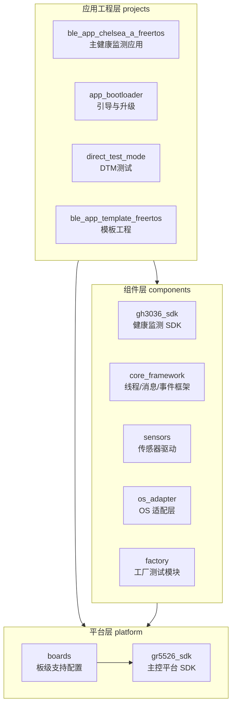
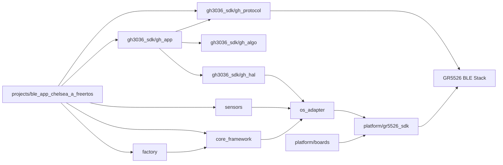
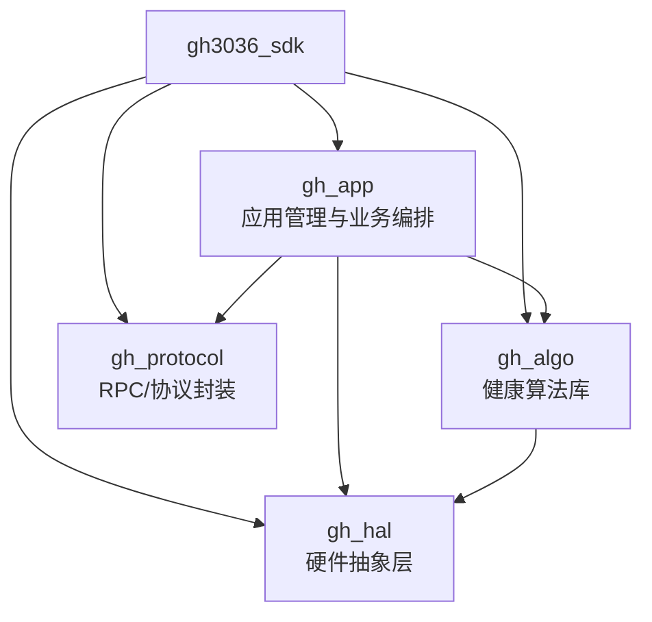
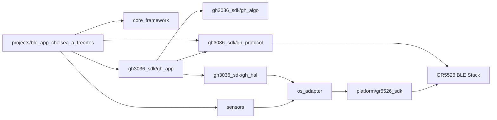
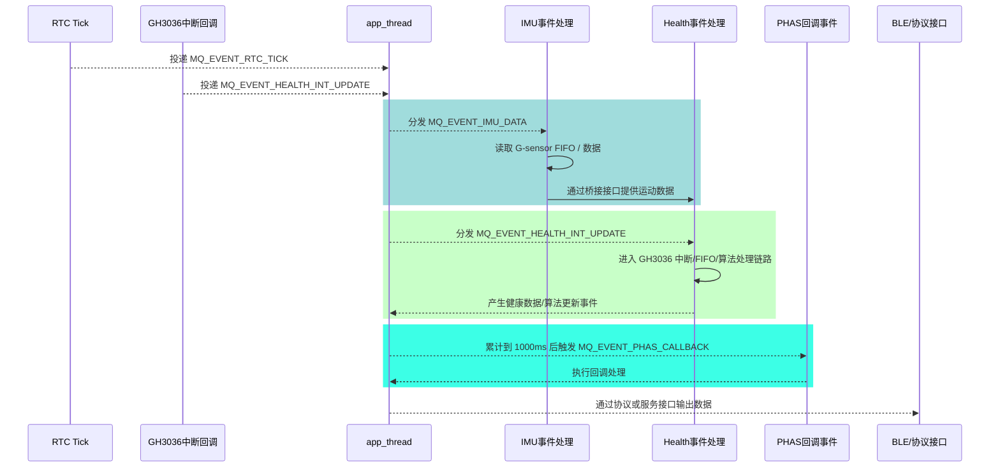
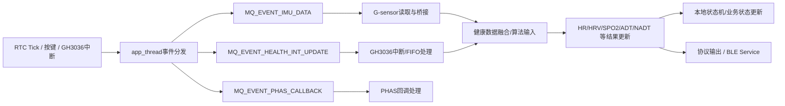

# L-EVK-T2-GH3038Q

## 1. 项目介绍

`L-EVK-T2-GH3038Q` 是基于汇顶科技 `GH3036` 健康监测芯片的评估套件工程，目标平台为 `GR5526 + GH3036`。仓库内同时包含：

- 评估板完整应用工程
- GH3036 健康算法与驱动 SDK
- 核心线程/消息框架
- 传感器驱动与系统适配层
- 工厂测试与量产测试相关模块

适用于以下场景：

- 心率（HR）监测
- 心率变异性（HRV）监测
- 血氧（SPO2）监测
- 佩戴检测 / 活体检测
- BLE 数据上报
- 工厂测试与量产调试

相关文档：

- 项目文档：https://alidocs.dingtalk.com/i/nodes/1DKw2zgV2P7D273GsDR4Xbpp8B5r9YAn?utm_scene=team_space

---

## 2. 仓库定位与整体认识

从整体上看，本仓库不是单一应用，而是一个“**平台 + 组件 + 应用工程**”的组合：

- `platform/` 提供主控芯片 SDK 与底层平台能力
- `components/` 提供 GH3036 相关功能模块及公共组件
- `projects/` 提供不同用途的最终工程入口

可以把它理解为：

1. **平台层**解决“芯片怎么跑起来”
2. **组件层**解决“健康数据怎么采、怎么算、怎么管理”
3. **工程层**解决“功能怎样组装成一个可交付固件”

---

## 3. 软件总体架构

为避免不同工程的依赖关系混在一张图里，这里拆分为两部分：

- **仓库分层图**：描述仓库整体的层次划分
- **主工程依赖图**：描述 `ble_app_chelsea_a_freertos` 的核心模块依赖关系

### 3.1 仓库分层图



### 3.2 仓库分层说明

- `projects/` 是工程入口层，用于承载不同用途的最终固件工程。
- `components/` 是可复用功能层，封装健康监测、系统框架、传感器与适配能力。
- `platform/` 是底层平台层，提供主控 SDK 与板级支撑。
- 并不是每个 `projects/` 下的工程都依赖 `components/` 全部模块，因此这里只表达仓库分层关系，不展开具体工程依赖。

### 3.3 主工程依赖图

下面单独描述 `ble_app_chelsea_a_freertos` 的核心依赖关系：



### 3.4 主工程依赖说明

- `ble_app_chelsea_a_freertos` 是仓库中最完整的业务工程。
- 它显式依赖 `gh3036_sdk`、`core_framework`、`sensors`、`os_adapter`、`factory` 等模块。
- `gh3036_sdk` 内部再拆分为应用、算法、HAL、协议等子层。
- 所有上层能力最终落到 `platform/gr5526_sdk` 和板级配置上执行。

### 3.5 组件层说明

- `components/gh3036_sdk` 是核心业务组件，负责 GH3036 相关采样、算法、协议与应用封装。
- `components/core_framework` 负责应用线程、事件分发、消息队列与模块调度等运行框架能力。
- `components/sensors` 提供如 G-sensor 等外围传感器支持。
- `components/os_adapter` 将组件能力适配到具体 RTOS/平台环境。
- `platform/gr5526_sdk` 提供主控芯片驱动、中断、通信、BLE、时钟等基础能力。

---

## 4. 目录结构与模块职责

```text
l-evk-t2-gh3038-q/
├── components/
│   ├── gh3036_sdk/        # GH3036 SDK：算法、应用、HAL、协议
│   ├── core_framework/    # 核心框架：线程、事件、消息机制
│   ├── sensors/           # 传感器驱动，如加速度计
│   ├── os_adapter/        # 操作系统适配层
│   └── factory/           # 工厂测试模块
├── config/                # 各类算法/测试配置文件
├── platform/
│   ├── boards/            # 板级配置
│   └── gr5526_sdk/        # 主控芯片 SDK
└── projects/              # 最终工程入口
```

### 4.1 `components/gh3036_sdk` 内部结构

`gh3036_sdk` 是本仓库最核心的模块，可继续拆成四层：



#### 各子模块职责

| 模块 | 作用 | 说明 |
|------|------|------|
| `gh_app` | 应用层封装 | 负责业务流程、状态切换、算法任务调度、结果管理 |
| `gh_algo` | 算法层 | 包含 `adt/hr/hrv/nadt/spo2/common` 等健康算法 |
| `gh_hal` | 硬件抽象层 | 屏蔽 GH3036 芯片访问细节，对接 I2C/SPI、中断、时间等 |
| `gh_protocol` | 通信协议层 | RPC 命令、数据打包、协议交互、上位机/调试命令接口 |

---

## 5. 模块之间的调用关系

下面从“主工程如何组织健康业务处理”的角度描述模块依赖关系：



### 关系解读

1. `ble_app_chelsea_a_freertos` 是主工程入口，负责初始化平台、服务和业务模块。
2. `core_framework` 提供统一的 `app_thread`、消息队列和事件分发机制，用于串联 IMU、Health、PHAS 等模块。
3. 健康业务逻辑由 `gh3036_sdk/gh_app` 统一编排。
4. 具体健康算法由 `gh_algo` 执行。
5. GH3036 芯片访问与中断处理由 `gh_hal` 完成。
6. G-sensor 等外围数据由 `sensors` 提供，并通过桥接链路送入健康算法侧。
7. `os_adapter` 将任务、锁、时间、中断等抽象适配到平台实现。
8. 最终通过 `platform/gr5526_sdk` 调用主控底层能力，并通过协议层或 BLE Service 对外输出数据。

---

## 6. 主工程工作流程

主工程 `projects/ble_app_chelsea_a_freertos/` 是当前仓库最重要的运行工程，其核心特点包括：

- 基于 `FreeRTOS`
- 集成 `GH3036` 健康监测芯片驱动
- 支持 `HR / HRV / SPO2 / 佩戴检测 / 活体检测`
- 集成加速度传感器 `LIS2DW12`
- 支持 BLE 数据传输
- 支持 OTA 与工厂测试模式

### 6.1 主流程说明

- 系统启动后，先进行基础初始化与任务创建。
- 默认启动**佩戴检测**。
- 检测到佩戴后，进入**活体检测/健康监测相关流程**。
- RTC tick、芯片中断或按键等事件会被转换为消息，并交由 `app_thread` 统一调度。
- G-sensor 数据与 GH3036 健康数据在对应事件处理链路中完成采集、处理与结果更新。
- 算法结果汇总后，再通过协议层或 BLE Service 对外输出。

### 6.2 主工程运行时序图

结合 `components/core_framework` 的当前实现，主工程的组织方式更准确地说是“**RTC / 外设中断负责触发，`app_thread` 负责消息化分发与处理**”。

其关键特点如下：

- `core_framework` 当前以单个 `app_thread` 作为核心处理线程，而不是为 G-sensor、PPG、BLE 分别建立独立业务线程。
- RTC tick 到来后，主工程不会在 RTC 回调中直接执行采样或算法，而是向应用消息队列投递 `MQ_EVENT_RTC_TICK`。
- `app_thread` 收到 `MQ_EVENT_RTC_TICK` 后，会进一步拆分出：
  - `MQ_EVENT_IMU_DATA`：触发 IMU / G-sensor 数据读取
  - `MQ_EVENT_HEALTH_INT_UPDATE`：触发 GH3036 健康数据处理链路
- 框架内部还会累计 tick 时间，在达到 `1000ms` 时投递 `MQ_EVENT_PHAS_CALLBACK`，用于触发 PHAS 相关回调。
- 默认 RTC tick 周期是 `1000ms`，但在特定模式下可调整为 `200ms`，因此这里更适合使用“RTC tick”而不是“固定 1 秒中断”来描述。
- BLE 在当前实现中更适合描述为“协议/服务交互出口”，而不是独立的“BLE 上报线程”。

下面的时序图用于表达当前代码中的主干调度路径：



### 6.3 时序说明补充

从当前实现看，主工程运行链路更适合按以下层次理解：

1. **触发层**
      - RTC tick 和 GH3036 硬件中断只负责“发事件”，不直接做复杂业务处理。

2. **调度层**
      - `app_thread` 作为统一的事件消费线程，从消息队列取出事件并分发给 IMU、Health、PHAS 模块。

3. **数据层**
      - IMU 模块读取加速度数据后，通过桥接接口送入 GH3036 SDK。
      - Health 模块负责驱动 GH3036 的中断/FIFO/算法处理链路。

4. **输出层**
      - 算法结果、原始数据或协议数据更新后，再进入 BLE Service 或协议处理链路。

因此，README 中不再将当前实现描述为“多个独立业务线程并行运行”，而是描述为“**统一应用线程 + 消息队列驱动的事件处理框架**”。

---

## 7. 健康数据处理链路

从“事件如何驱动数据处理”的角度，可将主链路概括如下：



### 链路说明

- **触发源**：RTC tick、GH3036 中断、按键或模式切换事件。
- **调度中心**：所有业务事件先进入 `app_thread` 消息分发链路，而不是在中断回调中直接完成复杂处理。
- **IMU 路径**：G-sensor 数据由 IMU 模块读取后，通过桥接接口送入健康算法侧。
- **Health 路径**：GH3036 数据处理通过 `MQ_EVENT_HEALTH_INT_UPDATE` 进入健康模块处理链路。
- **PHAS 路径**：PHAS 回调按 tick 累计时间触发，用于补充周期性回调处理。
- **结果出口**：健康结果可用于本地状态更新，也可通过协议层或 BLE Service 对外输出。

---

## 8. 工程划分说明

| 工程名称 | 路径 | 说明 |
|---------|------|------|
| `ble_app_chelsea_a_freertos` | `projects/ble_app_chelsea_a_freertos/` | 主工程，基于 FreeRTOS 的健康监测应用 |
| `app_bootloader` | `projects/app_bootloader/` | 启动引导程序工程，用于固件升级 |
| `direct_test_mode` | `projects/direct_test_mode/` | DTM 测试工程，仅用于 GR5526 的 Direct Test Mode 测试，不涉及 GH3036 等其他器件 |
| `ble_app_template_freertos` | `projects/ble_app_template_freertos/` | BLE + FreeRTOS 模板工程 |

### 选型建议

- 若要看完整业务流程，优先从 `ble_app_chelsea_a_freertos` 入手。
- 若要进行 `GR5526` 的 DTM 测试，可参考 `direct_test_mode`。
- 若要做新产品移植，可根据需求从 `ble_app_template_freertos`、`components/core_framework` 和 `components/gh3036_sdk` 组合入手。

---

## 9. 配置与模式说明

### 9.1 配置文件

`config/` 目录保存了不同场景下的算法/测试配置文件，例如：

- `HR_HRV_SPO2_NADT_*.config`
- `PPG_Noise_TEST1_*.config`
- `Base_Noise_TEST1_*.config`
- `factory_config/`

这些配置通常用于：

- 算法参数切换
- 测试方案切换
- 工厂校准/产测配置

### 9.2 工作模式

支持以下工作模式：

- `0`：MCU 在线模式（MCU online mode）
- `1`：MCU 离线模式（MCU offline mode）
- `2`：量产测试模式（MPT test mode）

设置命令示例：

```c
RPC_send("GHSetWorkModeCmd", "<u8>", 2)
```

量产测试模式下，功能可直接启动测试，不受常规业务状态限制。

---

## 10. 使用说明

1. 确认 GH3036 与主控芯片之间的 `I2C/SPI` 连接正确。
2. 根据需求配置全局参数，如 `gh_global_config.h`。
3. 实现或检查 HAL 移植接口。
4. 根据具体工程启用所需模块。
5. 编译并下载至目标板进行测试。

---

## 11. 编译说明

### 开发环境

- 编译工具：`Keil MDK / GCC`
- 目标芯片：`GR5526 (主控) + GH3036 (健康监测)`

### 编译步骤

1. 确保仓库及子模块已正确拉取。
2. 打开 `projects/ble_app_chelsea_a_freertos/Keil_5` 下工程文件。
3. 确认工程已包含以下组件：
    - `components/gh3036_sdk`
    - `components/core_framework`
    - `components/sensors`
    - `components/os_adapter`
    - `components/factory`
4. 编译工程。

### 关键配置

- 通信接口：通过 `gh_hal_config.h` 配置 `I2C / SPI`
- 中断/轮询模式：通过 HAL 配置项选择

---

## 12. Git 仓库下载与更新

**首次下载（含子模块）：**

```bash
git clone --recursive https://gitee.com/your-repo/l-evk-t2-gh3038-q.git
```

**后续更新：**

```bash
git pull && git submodule update --init --recursive --remote
```

---

## 13. 按键映射与功能定义

### 按键映射

- `SW1 : AON_GPIO_5  ->  BSP_KEY_UP_ID`
- `SW2 : AON_GPIO_6  ->  BSP_KEY_DOWN_ID`
- `SW3 : AON_GPIO_7  ->  BSP_KEY_OK_ID`

### 按键功能表

| 按键ID | 单击 | 双击 | 长按 |
|--------|------|------|------|
| `BSP_KEY_UP_ID` | 启动 HR/HRV | 停止 HR/HRV | - |
| `BSP_KEY_DOWN_ID` | 启动 SPO2 | 停止 SPO2 | - |
| `BSP_KEY_OK_ID` | 启动 TEST1 | 停止 TEST1 | - |

---

## 14. 默认业务行为说明

- 默认启动**佩戴检测**，检测到佩戴后开启**活体检测**。
- **定时心率检测**：默认每 `5` 分钟开启一次，每次持续 `2` 分钟。
- **按键触发**：可主动开启心率/血氧检测。
- **异常处理**：非活体状态下若设备脱落，需**长按 SW2** 重新启动佩戴检测流程。

---

## 15. 参与贡献

1. Fork 本仓库
2. 新建 `Feat_xxx` 分支
3. 提交代码
4. 新建 Pull Request
