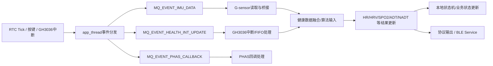

# 健康数据处理链路 — 文件映射与详细说明

> 本文档基于 README 中第 7 节的链路图，将每个节点对应到具体的源文件与函数。
> 主工程路径：`projects/ble_app_chelsea_a_freertos/Src/`
> 适用于后续在此项目上进行功能增删时的代码定位。

---

## 链路总图



---

## 节点 A：触发源

RTC Tick、按键、GH3036 硬件中断等外部事件，负责将信号转换为消息投递到应用消息队列，**不在中断上下文中做复杂处理**。

### A-1. RTC Tick

| 文件 | 关键函数 | 说明 |
|------|---------|------|
| `components/core_framework/src/app_thread.c:52-72` | `app_thread_dispatch_rtc_tick()` | RTC tick 分发器，每 tick（默认 200ms）投递 `MQ_EVENT_IMU_DATA` 和 `MQ_EVENT_HEALTH_INT_UPDATE` |
| `components/core_framework/src/app_thread.c:100-106` | `app_thread()` 主循环 | 收到 `MQ_EVENT_RTC_TICK` 时调用 `dispatch_rtc_tick()` |
| `components/core_framework/src/app_thread.c:4-5` | `s_app_tick_period_ms = 200` | RTC tick 周期（默认 200ms，MPT 模式下保持 200ms，非 MPT 为 1000ms） |
| `projects/.../Src/gh3036sdk/gh_demo.c:228-240` | `GHSetWorkModeCmd()` | 切换工作模式时调整 RTC tick 周期 |
| `projects/.../Src/user/main.c` | `main()` | 系统初始化，创建 RTC 定时器任务 |

### A-2. 按键

| 文件 | 关键函数 | 说明 |
|------|---------|------|
| `projects/.../Src/user/user_app.c` | `ble_evt_handler()` | BLE 事件处理（按键通过 BSP 层映射） |
| `projects/.../Src/user/user_app.c:57-66` | `BSP_KEY_UP/DOWN/OK_ID` | 按键 ID 定义，对应 SW1/SW2/SW3 |
| `components/core_framework/inc/app_mqueue.h` | `MQ_EVENT_RTC_TICK=1` | 按键事件最终也通过消息队列进入 app_thread |
| `components/core_framework/inc/app_mqueue_health.h:6-19` | `MQ_EVENT_HEALTH_START_MODE` / `STOP_MODE` | 按键触发的健康启动/停止事件 |

### A-3. GH3036 硬件中断

| 文件 | 关键函数 | 说明 |
|------|---------|------|
| `projects/.../Src/gh3036sdk/gh_hal/gh_hal_user_for_gr5526.c` | 板级中断处理 | GH3036 INT 引脚到 MCU 中断映射 |
| `components/core_framework/src/app_thread_health.c:14-21` | `gh_int_handler_call_back()` | Zephyr 下 GH3036 中断回调；投递 `MQ_EVENT_HEALTH_INT_UPDATE` |
| `components/gh3036_sdk/gh_hal/hw_service/src/gh_hal_isr.c:65-138` | `gh_hal_isr()` | 读取中断状态寄存器、FIFO 数据、更新 AGC |

---

## 节点 B：app_thread 事件分发

核心调度中心：所有业务事件通过应用消息队列进入 `app_thread`，由该线程统一分发。

| 文件 | 关键函数 | 说明 |
|------|---------|------|
| `components/core_framework/src/app_thread.c:86-120` | `app_thread()` | 主线程函数：初始化框架→注册 API→发 INIT 事件→进入事件循环 |
| `components/core_framework/src/app_thread.c:122-130` | `app_thread_init()` | 创建 `app_thread` 任务（FreeRTOS） |
| `components/core_framework/src/app_thread.c:100-118` | 主循环体 | `app_mqueue_receive()` 接收事件 → 分发到 `imu_event_process()` / `health_event_process()` / `phas_event_process()` |
| `components/core_framework/inc/app_mqueue.h:47-52` | `mqueue_event_t` | 事件结构体：`{type, data}` |
| `components/core_framework/src/app_mqueue.c` | `app_mqueue_init/send/receive` | 消息队列实现 |
| `components/core_framework/inc/app_mqueue.h:57` | `MQUEUE_MAX_SIZE=20` | 队列最大容量 |

### 事件注册

| 文件 | 关键函数 | 说明 |
|------|---------|------|
| `projects/.../Src/gh3036sdk/gh_demo.c:210-218` | `health_register_api()` | 注册 `gh_app_demo_init/start/stop/int_process/cfg_switch` |
| `projects/.../Src/sensor/lis2dw12/lis2dw12.c:302-315` | `imu_register_api()` | 注册 `lis2dw12_init/start/stop/read_data/...` |
| `components/core_framework/src/app_thread_phas.c:91-93` | `phas_register_api()` | PHAS 注册（弱符号，默认空） |

---

## 节点 C：MQ_EVENT_IMU_DATA

从 RTC tick 分发事件中拆出的 IMU/G-sensor 数据读取触发事件。

| 文件 | 关键函数 | 说明 |
|------|---------|------|
| `components/core_framework/src/app_thread.c:54` | `app_thread_dispatch_rtc_tick()` | 每 tick 投递 `MQ_EVENT_IMU_DATA` |
| `components/core_framework/inc/app_mqueue_imu.h:14` | `MQ_EVENT_IMU_DATA=0x0208` | IMU 数据事件定义 |
| `components/core_framework/src/app_thread_imu.c:72-89` | `imu_event_process()` 处理 `MQ_EVENT_IMU_DATA` | 调用已注册的 `imu_read_data`，然后通过发布钩子推送 |

### 事件分支

```c
// app_thread.c 主循环中
imu_event_process(&event);     // 处理所有 IMU 相关事件（包括 MQ_EVENT_IMU_DATA）
health_event_process(&event);  // 处理所有 Health 相关事件
phas_event_process(&event);    // 处理所有 PHAS 相关事件
```

---

## 节点 D：MQ_EVENT_HEALTH_INT_UPDATE

GH3036 中断触发后的健康数据处理事件。

| 文件 | 关键函数 | 说明 |
|------|---------|------|
| `components/core_framework/src/app_thread.c:55` | `app_thread_dispatch_rtc_tick()` | 每 tick 投递 `MQ_EVENT_HEALTH_INT_UPDATE` |
| `components/core_framework/inc/app_mqueue_health.h:7` | `MQ_EVENT_HEALTH_INT_UPDATE=0x0101` | 健康中断更新事件定义 |
| `components/core_framework/src/app_thread_health.c:113-119` | `health_event_process()` 处理 `MQ_EVENT_HEALTH_INT_UPDATE` | 调用 `health_interrupt_process()` |
| `components/core_framework/src/app_thread_health.c:345-349` | `health_interrupt_process()` | 通过 API 上下文调用已注册的 `afe_interrupt_process` |
| `projects/.../Src/gh3036sdk/gh_demo.c:183-192` | `gh_app_demo_int_process()` | 加互斥锁→调用 `gh_hal_isr()`→释放互斥锁 |

### 区别说明

- **RTC tick 投递**的 `MQ_EVENT_HEALTH_INT_UPDATE`：周期性的"假中断"处理（用于轮询模式或 tick 驱动的数据采集）。
- **GH3036 硬件中断**投递的 `MQ_EVENT_HEALTH_INT_UPDATE`：由真实硬件引脚中断触发（通过 `gh_hal_isr()` 处理）。

---

## 节点 E：G-sensor 读取与桥接

G-sensor (LIS2DW12) FIFO 数据读取后，通过桥接接口送入健康算法侧。

### 事件处理入口

```c
// app_thread_imu.c:72-89 — MQ_EVENT_IMU_DATA 的处理
imu_api_ctx.imu_read_data(imu_buf, &len, timestamp);  // 读取 G-sensor FIFO
s_imu_publish_hook(imu_buf, len);                      // 通过发布钩子推送
```

### 详细文件映射（从驱动到桥接）

#### 驱动层

| 文件 | 关键函数 | 说明 |
|------|---------|------|
| `projects/.../Src/sensor/lis2dw12/lis2dw12.c:250-282` | `lis2dw12_read_data_api()` | **G-sensor 数据读取入口**。从 FIFO 读取加速度原始数据，填充 `imu_data_t` 结构（accel_x/y/z, timestamp） |
| `projects/.../Src/sensor/lis2dw12/lis2dw12.c:211-213` | `lis2dw12_init_api()` | I2C 初始化、设备 ID 校验、中断配置 |
| `projects/.../Src/sensor/lis2dw12/lis2dw12.c:215-217` | `lis2dw12_start_api()` | 设置 ODR 启动采样（25Hz） |
| `projects/.../Src/sensor/lis2dw12/lis2dw12.c:219-221` | `lis2dw12_stop_api()` | 关闭 ODR 停止采样 |
| `projects/.../Src/sensor/lis2dw12/lis2dw12.c:122-149` | `app_lis2dw12_default_config()` | 默认配置：25Hz ODR, 4g FS, Stream-to-FIFO, 水印=25 |
| `projects/.../Src/sensor/lis2dw12/lis2dw12.c:188-209` | `lis2dw12_acceleration_raws_get()` | 批量读取加速度原始数据（6字节/样本） |
| `components/sensors/sensor/lis2dw12/driver/lis2dw12_reg.c` | 驱动寄存器层 | LIS2DW12 寄存器读写、FIFO 数据获取等底层操作 |

#### IMU 中间层

| 文件 | 关键函数 | 说明 |
|------|---------|------|
| `components/core_framework/src/app_thread_imu.c:72-89` | `imu_event_process()` | IMU 事件分发，调用已注册的 `imu_read_data` |
| `components/core_framework/src/app_thread_imu.c:96-112` | `imu_register_api_ctx()` | 注册 IMU 驱动 API |
| `components/core_framework/src/app_thread_imu.c:114-117` | `imu_register_publish_hook()` | 注册发布钩子（桥接到健康 SDK） |
| `components/core_framework/src/app_thread_imu.c:119-122` | `imu_register_timestamp_hook()` | 注册时间戳钩子 |

#### 桥接层

| 文件 | 关键函数 | 说明 |
|------|---------|------|
| `projects/.../Src/gh3036sdk/gh_gsensor_bridge.c:47-51` | `gh_gsensor_bridge_init()` | **桥接初始化**。注册 `gh_gsensor_bridge_publish` 为 IMU 发布钩子 |
| `projects/.../Src/gh3036sdk/gh_gsensor_bridge.c:25-45` | `gh_gsensor_bridge_publish()` | **桥接推送**。将 `imu_data_t` 转为 `gh_gsensor_ts_and_data_t`，调用 `gh_demo_gsensor_data_set()` |
| `projects/.../Src/gh3036sdk/gh_gsensor_bridge.c:20-23` | `gh_gsensor_bridge_get_timestamp()` | 获取桥接时间戳 |

### 数据流路径

```
LIS2DW12 FIFO
  → lis2dw12_read_data_api()         [projects/.../Src/sensor/lis2dw12/lis2dw12.c:250]
  → imu_event_process()               [components/core_framework/src/app_thread_imu.c:72]
  → s_imu_publish_hook()              [components/core_framework/src/app_thread_imu.c:86]
  → gh_gsensor_bridge_publish()       [projects/.../Src/gh3036sdk/gh_gsensor_bridge.c:25]
  → gh_demo_gsensor_data_set()        [components/gh3036_sdk/gh_app/src/gh_app.c:668]
  → gh_app_manager_gsensor_data_set() [components/gh3036_sdk/gh_app/src/app_manager/gh_app_manager.c]
  → gh_fusion_gsensor_data_push()     [components/gh3036_sdk/gh_app/src/app_fusion/gh_data_fusion.c:1162]
  → gh_sens_buf_gsensor_data_push()   [同文件:136] → sensor_buffer 环形缓冲队列
```

---

## 节点 F：GH3036 中断/FIFO 处理

GH3036 芯片的硬件中断发生后，读取 FIFO 数据并进行解析处理。

### 事件处理入口

```c
// app_thread_health.c:113-119 — MQ_EVENT_HEALTH_INT_UPDATE 的处理
health_interrupt_process();  // → api_ctx.afe_interrupt_process()
                            // → gh_app_demo_int_process()
                            // → gh_hal_isr()
```

### 详细文件映射

#### 中断处理主路径

| 文件 | 关键函数 | 说明 |
|------|---------|------|
| `projects/.../Src/gh3036sdk/gh_demo.c:183-192` | `gh_app_demo_int_process()` | 加锁 → `gh_hal_isr()` → 解锁 |
| `components/gh3036_sdk/gh_hal/hw_service/src/gh_hal_isr.c:65-138` | `gh_hal_isr()` | **核心中断处理**：唤醒→读中断状态→读 FIFO 使用量→循环读取 FIFO→AGC 更新→FIFO 数据发布→FIFO 解析 |
| `components/gh3036_sdk/gh_hal/hw_service/src/gh_hal_isr.c:75-76` | `gh_exit_lowpower_mode()` | 退出低功耗模式 |
| `components/gh3036_sdk/gh_hal/hw_service/src/gh_hal_isr.c:77` | `gh_get_irq()` | 读取中断状态寄存器（fifo_waterline, fifo_up_overflow, cap_cancel_done） |
| `components/gh3036_sdk/gh_hal/hw_service/src/gh_hal_isr.c:79` | `gh_hal_isr_event_publish()` | 发布 ISR 事件 |
| `components/gh3036_sdk/gh_hal/hw_service/src/gh_hal_isr.c:85` | `gh_get_fifo_use()` | 读取 FIFO 使用计数 |
| `components/gh3036_sdk/gh_hal/hw_service/src/gh_hal_isr.c:99-101` | `gh_fifo_read()` | 读取 FIFO 数据到缓冲区 |
| `components/gh3036_sdk/gh_hal/hw_service/src/gh_hal_isr.c:103` | `gh_fifo_timestamp_update()` | 更新时间戳 |
| `components/gh3036_sdk/gh_hal/hw_service/src/gh_hal_isr.c:108-112` | `gh_update_agc_info()` | 更新 AGC（自动增益控制）信息 |
| `components/gh3036_sdk/gh_hal/hw_service/src/gh_hal_isr.c:111-112` | `gh_fifo_parse_for_agc()` | AGC 回调解析 |
| `components/gh3036_sdk/gh_hal/hw_service/src/gh_hal_isr.c:122-124` | `gh_hal_fifo_data_publish()` | FIFO 数据发布（送给融合层） |
| `components/gh3036_sdk/gh_hal/hw_service/src/gh_hal_isr.c:126-127` | `gh_fifo_parse()` | FIFO 数据解析（校准+数据回调） |

#### FIFO 解析器

| 文件 | 关键函数 | 说明 |
|------|---------|------|
| `components/gh3036_sdk/gh_hal/hw_service/src/gh_hal_fifo_parser.c` | `gh_fifo_parse_process()` | 逐个样本解析 FIFO 数据（4字节/条目），将 PPG 原始数据、MIX 数据、BG 数据、DRE 数据、CAP 数据分类 |

#### HAL 硬件接口

| 文件 | 关键函数 | 说明 |
|------|---------|------|
| `components/gh3036_sdk/gh_hal/hw_interface/src/gh_hal_interface.c` | `gh_hal_regs_read/write()` | 寄存器访问（支持 SPI 软件 CS、SPI 硬件 CS、I2C） |
| `components/gh3036_sdk/gh_hal/hw_interface/src/gh_hal_interface.c` | `gh_hal_fifo_read()` | FIFO 数据读取 |
| `components/gh3036_sdk/gh_hal/hw_interface/src/gh_hal_chip.c` | `gh_hal_chip_init()` | 芯片初始化（电源、时钟、通信接口） |
| `projects/.../Src/gh3036sdk/gh_hal/gh_hal_chip.c` | 项目级 HAL 实现 | 项目特定的芯片配置 |

#### 板级中断映射

| 文件 | 说明 |
|------|------|
| `projects/.../Src/gh3036sdk/gh_hal/gh_hal_user_for_gr5526.c` | GH3036 INT 引脚到 MCU GPIO 中断的板级映射 |

### 数据流路径

```
GH3036 硬件中断
  → app_mqueue_send_event(MQ_EVENT_HEALTH_INT_UPDATE) [app_thread_health.c:19]
  → app_thread 主循环接收事件
  → health_event_process()                               [app_thread_health.c:113]
  → health_interrupt_process()                           [app_thread_health.c:345]
  → gh_app_demo_int_process()                            [gh_demo.c:183]
  → gh_hal_isr()                                         [gh_hal_isr.c:65]
    → 退出低功耗 → 读中断状态 → 读 FIFO → 
      → gh_fifo_read() → FIFO 数据入缓冲区
      → gh_update_agc_info() → gh_fifo_parse_for_agc()
      → gh_hal_fifo_data_publish() → 数据入融合层
      → gh_fifo_parse() → 数据解析回调
    → 进入低功耗
```

### 注意

`gh_hal_fifo_data_publish()` 的调用最终会通过 HAL 配置的数据回调函数将 PPG 数据推送到融合引擎（节点 G），调用链为：

```
gh_hal_fifo_data_publish()
  → gh_fifo_callback() (注册在 HAL 中)
  → gh_demo_ghealth_data_set()          [gh_app.c:649]
  → gh_app_manager_ghealth_data_set()
  → gh_fusion_ghealth_data_push()       [gh_data_fusion.c:1086]
  → gh_sens_buf_ghealth_data_push()     [同文件:222] → sensor_buffer 采样缓冲
```

---

## 节点 G：健康数据融合/算法输入

PPG 数据与 G-sensor 数据在融合引擎中进行通道匹配、时间同步后，送入算法处理。

### 融合引擎

| 文件 | 关键函数 | 说明 |
|------|---------|------|
| `components/gh3036_sdk/gh_app/src/app_fusion/gh_data_fusion.c:1012-1042` | `gh_fusion_init()` | 融合引擎初始化 |
| `components/gh3036_sdk/gh_app/src/app_fusion/gh_data_fusion.c:222-395` | `gh_sens_buf_ghealth_data_push()` | PPG 数据入传感器缓冲区。每个 FIFO 读取周期的样本被放入循环缓冲，读取结束后发出 `GH_MSG_NEW_GHEALTH_DATA` |
| `components/gh3036_sdk/gh_app/src/app_fusion/gh_data_fusion.c:136-166` | `gh_sens_buf_gsensor_data_push()` | G-sensor 数据入传感器缓冲区，发出 `GH_MSG_NEW_GSENOR_DATA` |
| `components/gh3036_sdk/gh_app/src/app_fusion/gh_data_fusion.c:876-1010` | `gh_collector_ghealth_data_pro()` | **核心收集逻辑**。遍历 PPG 样本，按通道映射匹配到功能帧（function frame） |
| `components/gh3036_sdk/gh_app/src/app_fusion/gh_data_fusion.c:554-643` | `gh_collector_gsensor_sync()` | G-sensor 时间同步：通过线性插值将 G-sensor 数据对齐到 PPG 帧时间戳 |
| `components/gh3036_sdk/gh_app/src/app_fusion/gh_data_fusion.c:493-522` | `linear_interpolate()` | 线性插值（G-sensor → PPG 时间对齐） |
| `components/gh3036_sdk/gh_app/src/app_fusion/gh_data_fusion.c:696-707` | `gh_cllct_frame_out_and_post_pro()` | **帧输出**：所有通道收集完成后，调用 `frame_publish()` 回调 |
| `components/gh3036_sdk/gh_app/src/app_fusion/gh_data_fusion.c:802-874` | `gh_frame_data_fill()` | 将每个采样点的 PPG 数据、AGC 信息填入功能帧 |

### 帧发布回调

| 文件 | 关键函数 | 说明 |
|------|---------|------|
| `components/gh3036_sdk/gh_app/src/gh_app.c:228-330` | `gh_demo_manager_cb()` | **算法回调**。融合帧完成后被调用，负责 ADT/NADT 事件发布和算法数据发布 |
| `components/gh3036_sdk/gh_app/src/gh_app.c:324-327` | `data_publish(p_frame)` | 调用已注册的数据发布函数（`gh_demo_data_publish_func_get()`） |

### 算法处理入口

| 文件 | 关键函数 | 说明 |
|------|---------|------|
| `components/gh3036_sdk/gh_app/src/app_manager/gh_app_manager.c` | `gh_app_manager_fusion_callback()` | 融合回调 → 调用 `gh_algo_process()` |
| `components/gh3036_sdk/gh_app/src/app_manager/gh_algo_adapter.c:503-540` | `gh_algo_process()` | 根据帧 ID（功能类型）调用对应的算法处理函数 |

### 算法映射表

| 文件 | 关键结构 | 说明 |
|------|---------|------|
| `components/gh3036_sdk/gh_app/src/app_manager/gh_algo_adapter.c:146-193` | `g_algo_inf_map[GH_FUNC_FIX_IDX_ALGO_MAX]` | 算法接口映射表，`{init, deinit, process}`，每个功能索引对应一种算法 |
| `components/gh3036_sdk/gh_app/src/app_manager/gh_algo_adapter.c:788-1027` | `gh_goodix_algo_inf_process()` | 通用算法处理：构建 `gh_algo_common_input_t` 输入，按 `p_frame->id` 分派到不同算法 |

---

## 节点 H：HR/HRV/SPO2/ADT/NADT 等结果更新

各算法执行完毕后，结果通过回调逐层返回应用层。

### 算法处理函数映射

| 功能 | 固定索引 | 算法入口 | 所在文件 |
|------|---------|----------|---------|
| **ADT** (佩戴检测) | `GH_FUNC_FIX_IDX_ADT=0` | `gh_algo_adt_exe()` | `gh_app/src/app_manager/gh_algo_adt.c` |
| **HR** (心率) | `GH_FUNC_FIX_IDX_HR=1` | `gh_goodix_algo_inf_process()` → `goodix_hba_calc()` | `gh_algo_adapter.c:880-916`；算法库 `gh_algo/hr/` |
| **SPO2** (血氧) | `GH_FUNC_FIX_IDX_SPO2=2` | `gh_goodix_algo_inf_process()` → `goodix_spo2_calc()` | `gh_algo_adapter.c:917-948`；算法库 `gh_algo/spo2/` |
| **HRV** (心率变异性) | `GH_FUNC_FIX_IDX_HRV=3` | `gh_goodix_algo_inf_process()` → `goodix_hrv_calc()` | `gh_algo_adapter.c:950-984`；算法库 `gh_algo/hrv/` |
| **GNADT** (绿光活体) | `GH_FUNC_FIX_IDX_GNADT=4` | `gh_goodix_algo_inf_process()` → `goodix_nadt_calc()` | `gh_algo_adapter.c:986-1020`；算法库 `gh_algo/nadt/` |
| **IRNADT** (红外活体) | `GH_FUNC_FIX_IDX_IRNADT=5` | `gh_goodix_algo_inf_process()` → `goodix_nadt_calc()` | `gh_algo_adapter.c:986-1020`；算法库 `gh_algo/nadt/` |

### 算法结果数据结构

| 文件 | 结构体 | 说明 |
|------|--------|------|
| `components/gh3036_sdk/gh_app/inc/gh_algo_hr.h` | `gh_algo_hr_result_t` | HR 结果（`hr_out`, `hba_out_flag`, `valid_score`, `hba_snr`, `valid_level`） |
| `components/gh3036_sdk/gh_app/inc/gh_algo_spo2.h` | `gh_algo_spo2_result_t` | SPO2 结果（`final_spo2`, `final_r_val`, `final_confi_coeff`, `final_invalidFlg`） |
| `components/gh3036_sdk/gh_app/inc/gh_algo_hrv.h` | `gh_algo_hrv_result_t` | HRV 结果（`rri[4]`, `rri_confidence`, `rri_valid_num`） |
| `components/gh3036_sdk/gh_app/inc/gh_algo_adt.h` | `gh_algo_adt_result_t` | ADT 结果（`wear_evt`, `det_status`） |
| `components/gh3036_sdk/gh_app/inc/gh_algo_nadt.h` | `gh_algo_nadt_result_t` | NADT 结果（`nadt_out`, `nadt_confi`, `nadt_out_flag`） |

### 结果回调回传路径

```
gh_algo_process()
  → goodix_hba_calc / goodix_spo2_calc / ... (结果写入 p_frame->p_algo_res)
  → gh_demo_manager_cb()                     [gh_app.c:228]
    ├── ADT: gh_demo_manager_cb() → evt_publish(GH_ACTION_WEAR_ON/OFF)
    ├── NADT: gh_demo_manager_cb() → evt_publish(GH_ACTION_NADT_WEAR_OFF/ON)
    └── data_publish(p_frame) → gh_demo_data_publish_func_get()
        → gh_app_user.c 中注册的 data publish 回调
        → 事件发布 (MQ_EVENT_HEALTH_ALGO_UPDATE) 或 (MQ_EVENT_HEALTH_WEAR_UPDATE)
  → app_thread_health.c 处理结果事件
    ├── MQ_EVENT_HEALTH_ALGO_UPDATE → health_algo_data_hook()
    └── MQ_EVENT_HEALTH_WEAR_UPDATE → 穿戴状态机
```

### 结果处理（应用层）

| 文件 | 关键函数 | 说明 |
|------|---------|------|
| `components/core_framework/src/app_thread_health.c:39-101` | `health_algo_data_hook()` | **结果通知钩子**。根据 `mode_func` 分发到各算法的输出处理 |
| `components/core_framework/src/app_thread_health.c:43-49` | HR 结果处理 | 记录 `health_status.hr`，自动停止检测 |
| `components/core_framework/src/app_thread_health.c:51-62` | HRV 结果处理 | 记录 RRI 值，自动停止检测 |
| `components/core_framework/src/app_thread_health.c:64-76` | SPO2 结果处理 | 记录 `health_status.spo2`，自动停止检测 |
| `components/core_framework/src/app_thread_health.c:78-84` | NADT 结果处理 | 记录穿戴/有效分数 |

---

## 节点 I：本地状态机/业务状态更新

状态机管理穿戴状态、模式切换、自动/手动检测的启停逻辑。

### 核心状态

| 文件 | 关键结构/变量 | 说明 |
|------|--------------|------|
| `components/core_framework/src/app_thread_health.c:10` | `health_status_t health_status` | 全局健康状态实例 |
| `components/core_framework/src/app_thread_health.c:10` | 结构体字段 | `running_mode`（当前运行功能）、`ready_mode`（就绪等待穿戴功能）、`auto_run_mode`（自动发起）、`manual_run_mode`（手动发起）、`wear_status`（穿戴状态） |
| `components/core_framework/inc/app_thread_health.h` | `health_status_t` | 状态结构体定义 |
| `components/core_framework/inc/app_health_type_for_chealse_a.h` | `HEALTH_MODE_ADT/HR/HRV/SPO2/NADT` | 健康模式常量映射到 `GH_FUNCTION_*` |

### 状态机处理（关键事件）

| 事件 | 处理函数 | 位置 | 行为 |
|------|---------|------|------|
| `MQ_EVENT_HEALTH_INIT` | `health_event_process()` | `app_thread_health.c:108-112` | 初始化芯片 → 启动 ADT → 启动自动定时器 |
| `MQ_EVENT_HEALTH_INT_UPDATE` | `health_event_process()` | `app_thread_health.c:113-119` | 中断处理，首次启动自动定时器 |
| `MQ_EVENT_HEALTH_START_MODE` | `health_event_process()` | `app_thread_health.c:138-151` | ADT 直接启动；其他模式判断穿戴状态后启动或进入 ready |
| `MQ_EVENT_HEALTH_STOP_MODE` | `health_event_process()` | `app_thread_health.c:152-154` | 停止指定模式 |
| `MQ_EVENT_HEALTH_WEAR_UPDATE` | `health_event_process()` | `app_thread_health.c:155-181` | **穿戴状态机核心逻辑** |

### 穿戴状态机

```
WEAR_EVENT_ON_ADT (ADT 检测到佩戴):
  → 如果 ready_mode 非零 → 启动 ready 模式功能 → 清除 ready_mode
  → 使能 NADT

WEAR_EVENT_OFF_ADT (ADT 检测到摘除):
  → 停止所有非 ADT 功能

WEAR_EVENT_ON_NADT (NADT 检测到活体):
  → 停止 NADT（无操作，活体检测确认）

WEAR_EVENT_OFF_NADT (NADT 检测到非活体):
  → 停止 NADT
  → 进入未佩戴状态（移动检测触发）
```

### 自动模式定时器

| 文件 | 关键函数 | 说明 |
|------|---------|------|
| `components/core_framework/src/app_thread_health.c:270-288` | `health_auto_timer_init()` | 创建自动启动/停止定时器（周期 = `GH_APP_AUTO_START_TIMER_PERIOD_MINUTES`） |
| `components/core_framework/src/app_thread_health.c:291-301` | `health_auto_timer_start()` | 启动定时器（每 N 分钟启动一次 HR 检测） |
| `components/core_framework/src/app_thread_health.c:304-314` | `health_auto_timer_stop()` | 停止定时器 |
| `components/core_framework/src/app_thread_health.c:23-30` | `auto_start_timer_expiry_handler()` | 定时器到期 → 发送 `MQ_EVENT_HEALTH_AUTO_START_MODE` |
| `components/core_framework/src/app_thread_health.c:32-37` | `auto_stop_timer_expiry_handler()` | 定时器到期 → 发送 `MQ_EVENT_HEALTH_AUTO_STOP_MODE` |

---

## 节点 J：协议输出 / BLE Service

健康结果通过 BLE GATT 服务对外输出，同时支持通过 RPC 协议进行双向数据交互。

### BLE 健康服务（自定义 UART Service）

| 文件 | 关键函数 | 说明 |
|------|---------|------|
| `projects/.../Src/profiles/health/health.c:333-354` | `health_service_init()` | 初始化自定义 Goodix UART Service（128-bit UUID） |
| `projects/.../Src/profiles/health/health.c:311-331` | `health_tx_data_send()` | **数据发送**：通过 Notification 发送数据 |
| `projects/.../Src/profiles/health/health.c:48-53` | `HEALTH_SERVER_TX_UUID` / `RX_UUID` | TX: `0003...`, RX: `0004...` |
| `projects/.../Src/profiles/health/health.c:64-77` | `health_attr_idx_t` | 属性索引：SVC、TX_CHAR/VAL/CFG、RX_CHAR/VAL |
| `projects/.../Src/profiles/health/health.h:71-73` | `HEALTH_MAX_DATA_LEN=247` | 最大传输数据长度 |

### BLE 标准心率服务

| 文件 | 关键函数 | 说明 |
|------|---------|------|
| `projects/.../Src/user/user_app.c:157-166` | `services_init()` | 初始化 HRS (Heart Rate Service) |
| 平台 SDK | `hrs_heart_rate_measurement_send()` | 通过标准 HRS 发送心率测量值 |

### GH RPC 协议线程

| 文件 | 关键函数 | 说明 |
|------|---------|------|
| `projects/.../Src/gh3036sdk/gh_protocol_user_for_gr5526.c:209-235` | `gh_protocol_init()` | 初始化 PSRAM、创建 `gh_rpc_thread`、初始化 RPC 核心 |
| `projects/.../Src/gh3036sdk/gh_protocol_user_for_gr5526.c:237-285` | `gh_rpc_thread()` | **协议线程主循环**：从优先级队列接收事件，数据接收送 `GHRPC_process()`，数据发送通过 `health_tx_data_send()` |
| `projects/.../Src/gh3036sdk/gh_protocol_user_for_gr5526.c:127-152` | `gh_protocol_data_send()` | 发送数据到 BLE（按优先级排队） |
| `projects/.../Src/gh3036sdk/gh_protocol_user_for_gr5526.c:154-175` | `gh_protocol_data_recevice()` | 从 BLE 接收数据入队列 |

### 组件级协议

| 文件 | 说明 |
|------|------|
| `components/gh3036_sdk/gh_protocol/gh_rpccore.c / .h` | RPC 核心实现（命令分发、序列化） |
| `components/gh3036_sdk/gh_protocol/gh_data_package.c / .h` | 数据打包/解包 |
| `components/gh3036_sdk/gh_protocol/gh_protocol_cmd.c / .h` | 协议命令处理 |
| `components/gh3036_sdk/gh_protocol/gh_package.c / .h` | 包结构定义 |

### BLE 数据流

```
数据发送方向（芯片 → APP）:
  健康算法结果 / 协议数据
  → gh_demo_data_publish() [gh_app_user.c]
  → health_bt_service_send() [app_thread_health.c:398-411]
  → bt_ghealth_send() 或 health_tx_data_send() [health.c:311]
  → BLE Notification → 手机 APP

数据接收方向（APP → 芯片）:
  手机 APP 写指令
  → BLE GATT Write → health_evt_handler() [user_app.c:178-216]
  → gh_protocol_data_recevice() [gh_protocol_user_for_gr5526.c:154]
  → gh_rpc_thread → GHRPC_process()
```

### 应用层 BLE 初始化

| 文件 | 关键函数 | 说明 |
|------|---------|------|
| `projects/.../Src/user/user_app.c:442-469` | `ble_app_init()` | BLE 应用初始化：服务初始化（health + HRS + DFU）→ GAP 参数设置 → 启动广播 |
| `projects/.../Src/user/user_app.c:57` | `DEVICE_NAME="ChelseaA_OS"` | 广播设备名 |

---

## 节点 K：MQ_EVENT_PHAS_CALLBACK

PHAS（Phase/Session Health Analysis System）周期性回调事件，按累计 tick 时间触发。

| 文件 | 关键函数 | 说明 |
|------|---------|------|
| `components/core_framework/src/app_thread.c:57-61` | `app_thread_dispatch_rtc_tick()` | 累计 tick 时间，达到 1000ms 时投递 `MQ_EVENT_PHAS_CALLBACK` |
| `components/core_framework/src/app_thread.c:5` | `s_phas_tick_acc_ms` | PHAS tick 累计器 |
| `components/core_framework/inc/app_mqueue_phas.h:9` | `MQ_EVENT_PHAS_CALLBACK=0x0303` | PHAS 回调事件定义 |
| `components/core_framework/src/app_thread.c:100-118` | `app_thread()` 主循环 | 每次循环调用 `phas_event_process(&event)` |

---

## 节点 L：PHAS 回调处理

PHAS 模块用于处理周期性健康分析回调，当前代码中为第三方算法（GoMore/Firstbeat）预留的框架接口。

| 文件 | 关键函数 | 说明 |
|------|---------|------|
| `components/core_framework/src/app_thread_phas.c:68-89` | `phas_event_process()` | PHAS 事件处理：INIT（初始化算法库）、START/STOP（仅日志）、CALLBACK（当前为空） |
| `components/core_framework/src/app_thread_phas.c:12-49` | `phas_algo_init()` | **当前被 `#if 0` 禁用**。GoMore Health Index SDK 初始化占位符：内存分配、用户信息设置 |
| `components/core_framework/src/app_thread_phas.c:52-58` | `phas_algo_acc_set()` | 预缓冲加速度数据（最多 25 个样本），供 PHAS 算法使用 |
| `components/core_framework/src/app_thread_phas.c:60-65` | `phas_algo_ppg_set()` | 预缓冲 PPG 数据（最多 25 个样本），供 PHAS 算法使用 |
| `components/core_framework/src/app_thread_phas.c:3` | `phas_algo_ctx_t` | PHAS 算法上下文（`initialized`, `rtc_current_time`, `sdkMem`, `prevData`, `userInfo`, `isFristSetPrevData`, `isFristSetUserInfo`） |
| `components/core_framework/inc/app_thread_phas.h` | `PHAS_ALGO_VERSION_STR` | PHAS 算法版本字符串 |

### 当前状态

PHAS 模块目前处于**预留/存根状态**：

- `phas_algo_init()` 被 `#if 0` 包裹，不会实际初始化第三方算法
- `MQ_EVENT_PHAS_CALLBACK` 事件处理为空操作
- 数据缓冲函数 (`phas_algo_acc_set`, `phas_algo_ppg_set`) 提供了接口但暂未被调用
- 如需启用，需要：取消 `phas_algo_init()` 的 `#if 0` 注释→集成 GoMore/Firstbeat SDK→在回调中执行算法计算

---

## 完整数据流一览

### 主路径（RTC Tick 驱动）

```
RTC Tick (200ms)
  → app_mqueue_send_event(MQ_EVENT_IMU_DATA)            [app_thread.c:54]
  → app_mqueue_send_event(MQ_EVENT_HEALTH_INT_UPDATE)    [app_thread.c:55]
  → [每 1000ms] app_mqueue_send_event(MQ_EVENT_PHAS_CALLBACK)  [app_thread.c:61]

  ↓ app_thread 主循环接收并分发

  ├─ imu_event_process(MQ_EVENT_IMU_DATA)          [app_thread_imu.c:72]
  │   → lis2dw12_read_data_api()                   [lis2dw12.c:250]
  │   → gh_gsensor_bridge_publish()                [gh_gsensor_bridge.c:25]
  │   → gh_demo_gsensor_data_set()                 [gh_app.c:668]
  │   → gh_app_manager_gsensor_data_set()
  │   → gh_fusion_gsensor_data_push()              [gh_data_fusion.c:1162]
  │   → gh_sens_buf_gsensor_data_push()            [gh_data_fusion.c:136]
  │
  ├─ health_event_process(MQ_EVENT_HEALTH_INT_UPDATE)  [app_thread_health.c:113]
  │   → health_interrupt_process()                 [app_thread_health.c:345]
  │   → gh_app_demo_int_process()                  [gh_demo.c:183]
  │   → gh_hal_isr()                               [gh_hal_isr.c:65]
  │       → gh_fifo_read() → FIFO 数据
  │       → gh_update_agc_info()
  │       → gh_hal_fifo_data_publish() → gh_fifo_parse()
  │       → gh_demo_ghealth_data_set()             [gh_app.c:649]
  │       → gh_fusion_ghealth_data_push()          [gh_data_fusion.c:1086]
  │       → gh_sens_buf_ghealth_data_push()        [gh_data_fusion.c:222]
  │
  └─ phas_event_process(MQ_EVENT_PHAS_CALLBACK)   [app_thread_phas.c:68]
      → [当前为空操作]
```

### 融合与算法路径

```
sensor_buffer (ghealth + gsensor 双缓冲)
  → gh_collector_ghealth_data_pro()               [gh_data_fusion.c:876]
    → 通道匹配 → gh_frame_data_fill()
    → G-sensor 时间同步 → gh_collector_gsensor_sync() [gh_data_fusion.c:554]
    → gh_cllct_frame_out_and_post_pro()           [gh_data_fusion.c:696]
    → gh_demo_manager_cb()                        [gh_app.c:228]
      → gh_algo_process()                         [gh_algo_adapter.c:503]
        → goodix_hba_calc / spo2_calc / hrv_calc / nadt_calc
        → 结果写入 p_frame->p_algo_res
      → data_publish(p_frame)
```

### 结果回传路径

```
算法结果
  → gh_demo_manager_cb() → data_publish [gh_app.c:324-327]
  → gh_app_user.c 注册的 data publish 函数
  → 投递 MQ_EVENT_HEALTH_ALGO_UPDATE / MQ_EVENT_HEALTH_WEAR_UPDATE
  → health_event_process()                    [app_thread_health.c]
    ├── MQ_EVENT_HEALTH_ALGO_UPDATE → health_algo_data_hook()
    │   → 更新 health_status 状态变量
    │   → 自动停止判断
    └── MQ_EVENT_HEALTH_WEAR_UPDATE → 穿戴状态机
        → 启动/停止检测模式

  BLE 输出路径：
  → health_bt_service_send() / health_tx_data_send()
  → BLE Notification → 手机 APP
```

---

## 附录：关键头文件索引

| 头文件 | 说明 |
|--------|------|
| `components/core_framework/inc/app_mqueue.h` | 基础事件类型定义 |
| `components/core_framework/inc/app_mqueue_health.h` | 健康模块事件定义 |
| `components/core_framework/inc/app_mqueue_imu.h` | IMU 模块事件定义 |
| `components/core_framework/inc/app_mqueue_phas.h` | PHAS 模块事件定义 |
| `components/core_framework/inc/app_thread.h` | app_thread 主线程 API |
| `components/core_framework/inc/app_thread_health.h` | 健康模块线程 API + health_status_t |
| `components/core_framework/inc/app_thread_imu.h` | IMU 模块线程 API + imu_api_ctx_t |
| `components/core_framework/inc/app_thread_phas.h` | PHAS 模块线程 API |
| `components/core_framework/inc/app_health_type_for_chealse_a.h` | 健康模式常量 |
| `components/gh3036_sdk/gh_app/inc/gh_app.h` | GH SDK 应用层 API |
| `components/gh3036_sdk/gh_app/inc/gh_public_api.h` | GH SDK 公共 API |
| `components/gh3036_sdk/gh_app/inc/gh_app_manager.h` | 功能帧管理器 |
| `components/gh3036_sdk/gh_app/inc/gh_algo_adapter.h` | 算法适配器 |
| `components/gh3036_sdk/gh_app/inc/gh_data_fusion.h` | 数据融合引擎 |
| `components/gh3036_sdk/gh_hal/hw_service/inc/gh_hal_isr.h` | 中断处理 |
| `components/gh3036_sdk/gh_hal/hw_interface/inc/gh_hal_interface.h` | HAL 硬件接口 |
| `components/gh3036_sdk/gh_protocol/gh_rpccore.h` | RPC 核心 |
| `projects/.../Src/profiles/health/health.h` | BLE 健康服务 |
| `projects/.../Src/gh3036sdk/gh_demo.h` | 项目级 SDK 粘合声明 |
| `projects/.../Src/gh3036sdk/gh_gsensor_bridge.h` | G-sensor 桥接声明 |
| `projects/.../Src/sensor/lis2dw12/lis2dw12.h` | LIS2DW12 驱动声明 |
| `projects/.../Src/user/user_app.h` | BLE 应用初始化声明 |

> 注：`projects/.../Src/` 均指 `projects/ble_app_chelsea_a_freertos/Src/`
